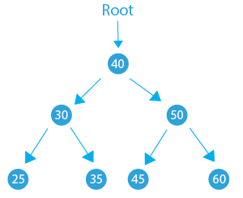
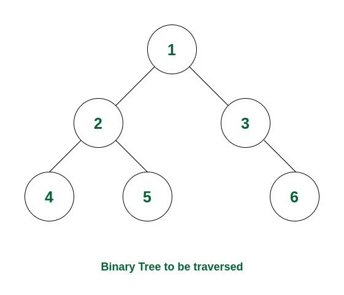

## tips
### 细节
1. 逻辑运算符是&&或||而不是|或&
2. ` min() `,` max() `只能进行两个值之间的比较
3. ` vector<string> `中的每个元素（即每个区间的表示形式）是以字符串形式存储的，因此这些字符串的表示在内部会带有引号，但引号并不会作为字符串本身的一部分，引号仅用于区分这些值是字符串类型
4. `lambda`函数用法
   - ` auto add = [](int a, int b) { return a + b; }; ` 不捕获外界变量
   - 按值捕获（`[=]`）：按值捕获外部变量，`lambda` 函数会复制这些变量
` auto addValue = [=]() { return x + y; }; `
   - 按引用捕获（`[&]`）：按引用捕获外部变量，`lambda` 函数使用外部变量的引用
```cpp
auto f=[&](int i,int j){
            return i==j? to_string(nums[i]):to_string(nums[i])+"->"+to_string(nums[j]);
        };
```
5. 注意在多层结构里变量初始化问题，在嵌套结构内定义的变量无法传递到外层结构
6. 在多维结构中顺序取出内部值
```cpp
vector<vector<int>> output;
       for (const auto& rows:mat)
       {
        
          for ( const auto&value:rows)
          {
            row.push_back(value);
            i++;
            if (i%c==0)
            {
                output.push_back(row);
                //vector<int> row; 此局部变量在if语句外会被销毁
                row.clear();
            }
            
          }
          
       }
```
7. `make_pair`与`pair`的区别
   - 使用`pair`时，必须显示指定模板参数的类型如`std::pair<int,double> mypair(42,3.14);`
   - `make_pair`是一个模板函数，可以自动推导类型并返回一个`std::pair`，如`auto mypair=make_pair(42,3.14);`
### ` <vector> `某些功能和注意
1. 在特定位置插入特定数量的值` vector.insert(positon,count,value) `position为迭代器
2. 对于多维数组，注意内部数组初始化分配空间，否则容易导致数组越界访问问题
```cpp
vector<vector<int>> nums(numRows);
        for (int i = 0; i < numRows; i++)
        {
            //需要在每一行开始时调用 resize() 函数，为每一行分配正确的大小。
            nums[i].resize(i+1);j//将此行注释掉会导致错误
            nums[i][0]=1;
            nums[i][i]=1;
        }
```
3. find函数在`<vector>`的应用
- 若没有找到则返回`end()`
- 找到则返回指向元素的迭代器
```cpp
auto dit=find(nums.begin(),nums.end(),i+1);
                    if(dit!=nums.end()){
                        errors[0]=i+1;
                    }
```
4. 多维数组初始化
```cpp
//初始化设置多维数组的空间大小
        vector<vector<int>> cal_v(rows,vector<int>(cols));
```
## 链表
- 链表使用的是非连续的内存块，动态扩展灵活，但其访问需要从头节点开始顺序遍历，所以随机访问效率较低。
### 链表基本使用
#### 单向链表节点定义
```cpp
struct Node{
    int data;//值域
    struct  Node* next;//指针域
    
    Node(int value):data(value),next(nullptr){}//节点构造函数
};
```
#### 创建单向链表
- 尾节点的next指向NULL或None，标志链表的结束
```cpp
class LinkedList{
public:
    Node* head;//链表头指针

    LinkedList():head(nullptr){}//链表构造函数，初始化头节点为nullptr
    ~LinkedList(){
        Node* current=head;
        while (current!=nullptr)//清理动态分配的节点内存
        {
            Node* next=current->next;
            delete current;
            current=next;
        }
        
    }
};
```
#### 插入节点
```cpp
void append(int value){
    //Node* newNode 表示 newNode 是一个指向 Node 类型的指针
    //使用 new 运算符时，new Node(value) 会在堆上动态分配一个 Node 对象并返回其地址
    Node* newNode=new Node(value);
    if (!head)
    {
        head=newNode;//如果链表为空，新节点为头节点
    }
    else
    {
        Node* temp=head;
        while (temp->next)//找到链表的最后一个节点
        {
            temp=temp->next;
        }
        temp->next=newNode;//将新节点添加到末尾
        
    }
}
```
#### 删除节点
- 删除操作需特别注意边界条件，特别当需删除的节点是头节点时
```cpp
void remove(int value){
        while (head&&head->data==value)//如果要删除的是头节点
        {
            Node* temp=head;
            head=head->next;//更新头指针
            delete temp;// 释放节点内存
        }
        if (!head) return;// 链表为空，直接返回
        Node* temp=head;
        while (temp->next)
        {
            if (temp->next->data==value)
            {
                Node* toDelete=temp->next;
                temp->next=temp->next->next;//跳过要删除的节点
                delete toDelete;//释放节点内存
                return;
            }
            else{
            temp=temp->next;}     
        }   
    }
```
#### 遍历链表与查找元素
```cpp
bool find(int value){
        Node* temp=head;
        while (temp)
        {
            if (temp->data==value)
            {
                return true;//找到元素
            }
            temp=temp->next;
        }
        return false;
    }
```
## 队列
- `std::queue`容器是一种先进先出的数据结构
- `std::queue`没有迭代器，访问元素的唯一方式是遍历容器内容，逐一删除访问过的元素
### 基本用法
| 函数 | 解释 |
| :------: | :------: |
| push() | 向队尾添加元素 |
| emplace() | 向队尾添加元素 |
| pop() | 移除当前队首元素 |
| back() | 返回队尾元素 |
| front() | 返回队首元素 |
| empty() | 判断队列是否为空 |
| size() | 返回队列的大小 |
| swap() | 将当前两个元素进行交换 |
- tips：push必须填入实例化的对象，emplace比较自由

## 栈
- `std::stack`容器是一种后进先出的数据结构
- `std::stack`没有迭代器，访问元素的唯一方式是遍历容器内容，逐一删除访问过的元素
### 基本用法
| 函数 | 解释 |
| :------: | :------: |
| push() | 向栈顶添加元素 |
| pop() | 移除栈顶元素 |
| top() | 返回栈顶元素 |
| empty() | 判断队列是否为空 |
| size() | 返回队列的大小 |

## 哈希表
### 哈希表初始化
` unordered_map<int, int> hashtable; `
` unordered_set<int> a; `
### 基本用法
| 函数 | 解释 |
| :------: | :------: |
| `mapName[key]=value` | 添加元素，但会产生覆盖问题 |
| `insert()` | 添加元素，重复插入会失败 |
| `hmap.erase(hmap.begin(), hmap.end())` | 删除某个位置开始到某个位置结束这一范围内的元素 |
| `hmap.erase()` | 传入key值删除键值对 |
| `empty()` | 判断哈希表是否为空 |
| `size()` | 返回哈希表的大小 |
| `find()` | 以key作为参数寻找哈希表中的元素 |
| `count()` | 统计某个key值对应的元素个数 |
### 查找哈希表内部值
```cpp
auto it = hashtable.find(target - nums[i]);
            if (it != hashtable.end()) {
                return {it->second, i};
            }
```
### 哈希表的遍历
- `unordered_map`并不保证按照插入顺序遍历元素
```cpp
unordered_map<int, int> hmap{ {1,10},{2,12},{3,13} };
unordered_map<int, int>::iterator iter = hmap.begin();
for( ; iter != hmap.end(); iter++){
 cout << "key: " <<  iter->first  << "value: " <<  iter->second <<endl;
}
```
### 遍历哈希表细节
- `for (const auto& pair:hashtable)`、`for (auto& pair:hashtable)`、`for (auto pair:hashtable)`的区别：
  1. 对于`for (const auto& pair:hashtable)`，`const` 表示 `pair `是一个常量引用，循环过程中不能修改 `pair` 的值。`auto&` 表示 `pair` 是一个引用，避免了对元素的拷贝。
  2. 对于`for (auto& pair:hashtable)`，可变引用 (`auto&`)，直接引用 `hashtable` 中的每个元素，允许修改元素值，且会直接作用在`hashtable` 本身。
  3. 对于`for (auto pair:hashtable)`，按值传递 (`auto`)，每次循环都会拷贝 `hashtable` 中的一个元素到 `pair`，可以修改 `pair`，但不会影响原始容器 `hashtable` 中的元素。
- 使用`unordered_map`：需要存储键值对，并且每个键只对应一个值时；使用`unordered_multimap`： 需要存储键对应多个值时

## set容器
### 使用细节
- set容器每次插入值会自动排序，默认从小到大且值各不相同,若要从大到小排序，注意初始化`std::set <data_type, greater<data_type>>`
- 集合是一种关联容器，其中每个元素必须是唯一的，因为元素的值可以识别它。这些值按特定的排序顺序存储，即升序或降序。
- 无法直接取出set里的值，需用迭代器取出
- 值特征——集合中的所有元素都有唯一的值。
- 值性质– 元素一旦添加到集合中，其值就无法修改，但可以删除该元素，然后添加修改后的值。因此，值是不可变的。
- begin取出第一个值，rbegin取出最后的值
### 基本用法
| 函数 | 解释 |
| :------: | :------: |
| `begin()` | 返回指向集合中第一个元素的迭代器 |
| `end()` | 返回指向集合中最后一个元素之后的理论元素的迭代器，用于从头到尾遍历集合，作为结束条件 |
| `rbegin()` | 返回指向set中最后一个元素的反向迭代器,用于反向遍历集合，从最后一个元素到第一个元素 |
| `erase()` | 传入key值删除 |
| `empty()` | 判断集合是否为空 |
| `size()` | 返回集合的大小 |
| `find()` | 如果找到，则返回指向集合中对应元素的迭代器，否则返回指向末尾的迭代器 |
| `count()` | 根据对应元素是否存在于集合中返回 1 或 0 |

```cpp
set<int> max;
for (int i = 0; i < nums.size(); i++)
        {
            if (max.size()<3)
            {
                max.insert(nums[i]);
                continue;
            }
            if (nums[i]>*max.begin())
            {
                max.insert(nums[i]);
                if (max.size()>3)
                {
                    max.erase(max.begin());
                }
                
            }    
        }
```

## tree 树(重点介绍二叉树)
{: style="display:block; margin:auto;" }
<p style="text-align:center;">二叉树</p>

### 基本概念
- 树形数据结构是一种非线性数据结构，因为它不按顺序存储。它是一种分层结构，因为树中的元素排列在多个级别中。
- 根节点：根节点是树层次结构中最顶层的节点。换句话说，根节点是没有任何父节点的节点。
- 叶节点：树中没有任何子节点的节点称为叶节点。叶节点是树的最底节点。一般树中可以有任意数量的叶节点。叶节点也可以称为外部节点。
- 二叉树第 'l' 层节点的最大数量为$2^l$，这里的层级是从根到节点的路径上的节点数（包括根和节点），根的层级为 0。
- 高度为 'h' 的二叉树的最大节点数为$2^h-1$，此处树的高度是根到叶路径上的最大节点数，单个节点的树的高度被视为 1。
- 在满二叉树中，除叶子节点外的每个节点都恰好有两个子节点，且所有叶节点必须在**同一层**；在完全二叉树中，树的每一层都是完全填充的，除了最后一层，最后一层尽量往左填充。
- 二叉树的中序、前序和后序遍历是三种常见的遍历树的方式：中序、前序和后序是三种不同的遍历二叉树的方式。中序遍历访问左子树、节点本身，然后访问右子树。前序遍历访问节点本身、左子树，然后访问右子树。后序遍历访问左子树、右子树，然后访问节点本身。
{: style="display:block; margin:auto;" }
<p style="text-align:center;">前序遍历</p>

{: style="display:block; margin:auto;" }
<p style="text-align:center;">中序遍历</p>

{: style="display:block; margin:auto;" }
<p style="text-align:center;">后序遍历</p>

## 二分法使用
### 从顺序数组中插入或找出特定值
```cpp
int left=0;
       int right=nums.size()-1;
       while (left<=right)
       {
        int mid=(left+right)/2;
        if (nums[mid]==target)
        {
            return mid;
        }
        else if (nums[mid]<target)
        {
            left=mid+1;
        }
        else if (nums[mid]>target)
        {
            right=mid-1;
        } 
       }
       return left;
```

## heap 堆
### 基本概念
- 堆是一种特殊的基于树的数据结构，具有以下属性：
  1. 它是一个完全二叉树。
  2. 它要么遵循最大堆属性，要么遵循最小堆属性。
  最大堆：根节点的值必须是其所有后代节点中最大的，并且其左子树和右子树也必须是最大的。
  最小堆：根节点的值必须是其所有后代节点中最小的，并且其左子树和右子树也必须是最小的。
- 当我们插入一个项目时，我们将其插入到最后一个可用插槽中，然后重新排列节点，以便保持堆属性。
- 当我们删除一个项目时，我们将根与最后一个节点交换，以确保删除最大或最小项目。然后我们重新排列剩余的节点以确保堆属性（最大或最小）
### 基本使用
- 定义：`std::priority_queue<int>`(最大堆)、`priority_queue <int，vector<int>，greater<int>>`(最小堆)

| 函数 | 解释 |
| :------: | :------: |
| `empty()` | 判断堆是否为空 |
| `size()` | 返回堆的大小 |
| `top()` | 返回对堆最顶部元素的引用 |
| `pop()` | 删除队列的第一个元素 |
| `swap()` | 用于交换两个堆的内容 |
| `emplace()` | 用于将新元素插入到堆中 |

- 对`std::priority_queue<int>`的排序模式进行改变以适应不同的排序需求
    1. 其中，对于`return a.second==b.second?a.first<b.first:a.second>b.second;`，可看作a为外来者，当此判断成立时返回true，即a的排列优先度低于b
    2. 自定义优先序列的方法需记住
```cpp
//自定义比较器
    auto cmp=[](const pair<string,int>&a,const pair<string,int>&b){
        return a.second==b.second?a.first<b.first:a.second>b.second;
    };

    priority_queue<pair<string,int>,vector<pair<string,int>>,decltype(cmp)> que(cmp);
```
## 算法思想
### 滑动窗口
- 在一个数组内部不断依次移动时，直接更新变量变化值而不是重新计算以增加效率
```cpp
double findMaxAverage(vector<int>& nums, int k) {
        //运用滑动窗口思想
        double avg=0;
        for (int i = 0; i < k; i++)
        {
            avg+=double(nums[i])/double(k);
        }
        double test_avg=avg;
        for (int i = 1; i < nums.size()-k+1; i++)
        {
            // test_avg-=double(nums[i-1])/double(k);
            // test_avg+=double(nums[i+k-1])/double(k);
            test_avg+=double(nums[i+k-1]-nums[i-1])/double(k);
            avg=max(avg,test_avg);
        }
        return avg;
    }
```

